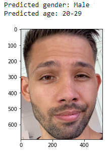
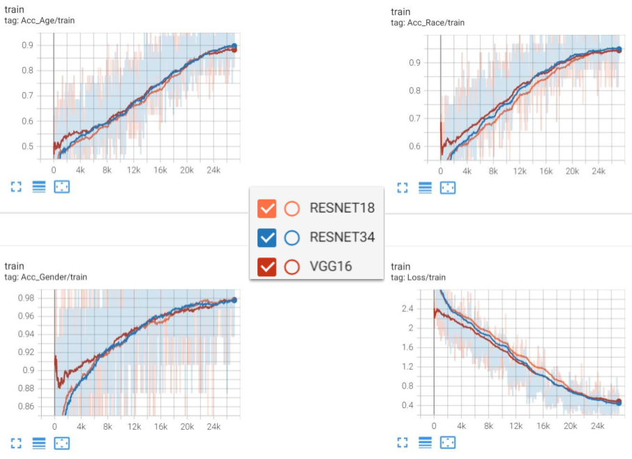

 ## Age👶👴 and Gender♀️♂️ Estimation with Transfer and Multi-Task Learning
 
[**💾 DATASET**](https://github.com/joojs/fairface) **|** [**💡 ORIGINAL IMPLEMENTATION**](https://github.com/dchen236/FairFace) **|** [**💻 Jupyter Notebook**](https://jupyter.org/install) **|** [**🔥 PyTorch**](https://pytorch.org/get-started/locally/) **|** **👁 CNN** **|** **💪🏽 CPU/GPU** **|**  [**🔗 LinkedIn**](https://www.linkedin.com/in/marcellbalogh) 👈🏽
#### 🔍 Description
<p align="justify">Multi-task learning is a subfield of Deep Learning in which multiple learning tasks (e.g. age and gender classification) are solved at the same time, while exploiting commonalities and differences across tasks. Transfer learning, on the other hand, is the reuse of pre-trained models (e.g. VGG16 RESNET18 and RESNET34) on a new problem. It's a very popular technique because it can train ANNs faster with comparatively little data. This project implements these two powerful techniques in PyTorch on FAIRFACE dataset to classify gender and age within a single model.</p>

<p align="center">
  
</p>

---
#### ☑️ Prerequisites
- Python3
- See [requirements.txt](requirements.txt) for required packages
- Windows, Linux, MacOS

###### ⚙️ Installation
```html
   git clone https://github.com/BaMarcy/age_gender_predictor
```
```html
   pip install -r requirements.txt
```
---
#### 🛠️ Train
###### ⚙️ Run
```html
   jupyter notebook train.ipynb
```
---
#### 💊 Predict
###### ⚙️ Run
```html
   jupyter notebook test.ipynb
```
The available models were trained with the following hyperparameters:

Hyperparameter  | Value
------------- | -------------
No. of Epochs | 1
Batch Size | 32
Learning Rate | 0.0001

The available models can be dowloaded from the following links:

CNN Model | Test Accuracy | Inference
| :--- | ---: | :---:
Vgg16  | Gender: 97% - Age: 82% | [vgg16.pt](https://drive.google.com/file/d/10L8BJqydyWBBmOI0T8QYedVYNnkCjAFP/view?usp=sharing)
ResNet18  | Gender: 98% - Age: 92% | [resnet18.pt](https://drive.google.com/file/d/10L8BJqydyWBBmOI0T8QYedVYNnkCjAFP/view?usp=sharing)
ResNet34  | Gender: 99% - Age: 89% | [resnet34.pt](https://drive.google.com/file/d/16U9HuW3ysy-EmS5xCnaX9MMHglcASjmK/view?usp=sharing)

---
#### 📉 Tensorboard


---
#### ☑️ TODO
- [x] Vgg16
- [x] ResNet18
- [x] ResNet34
- [ ] Streamlit
---
